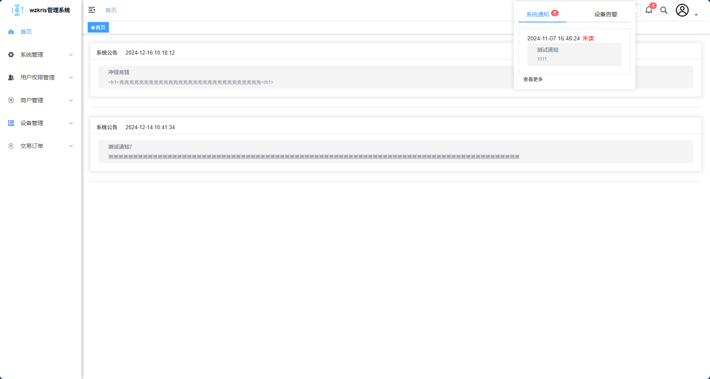
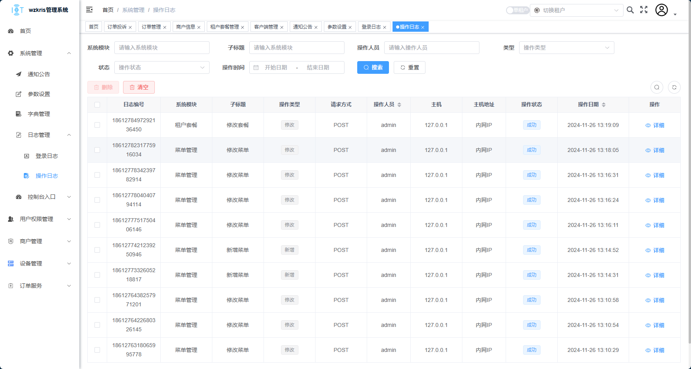
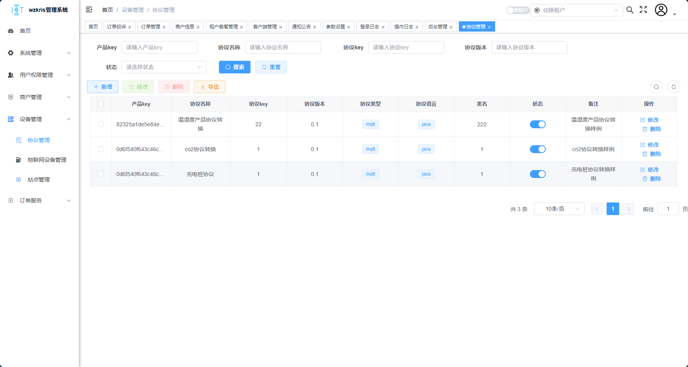
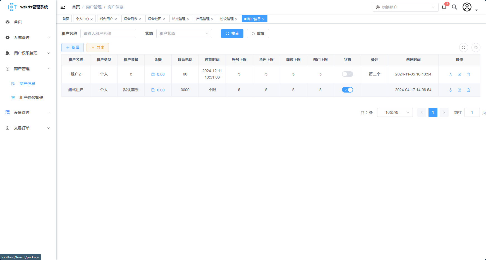
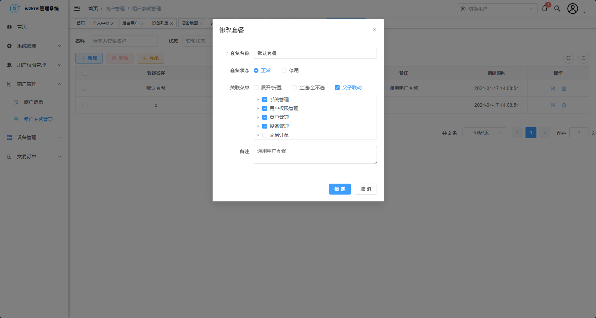
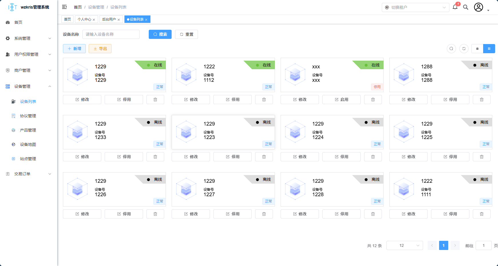
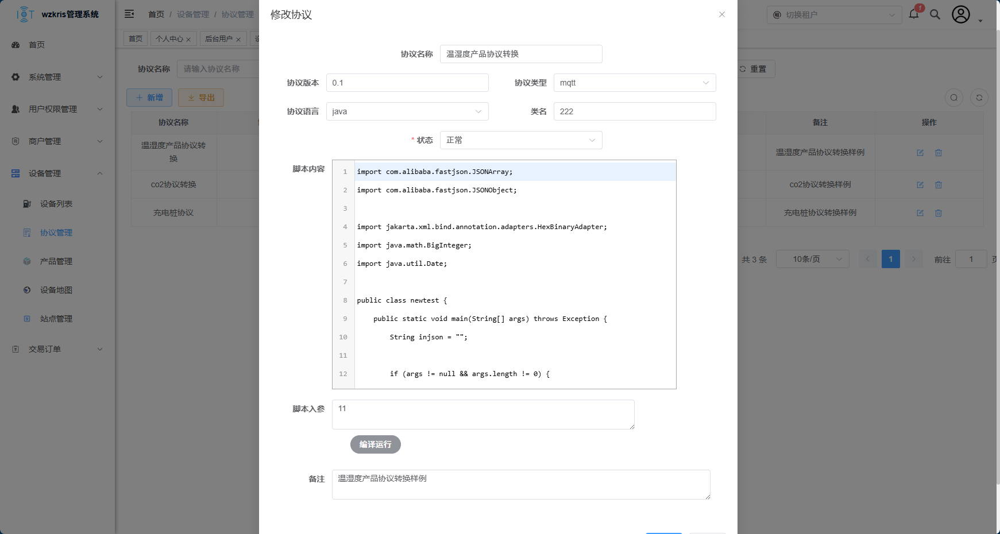
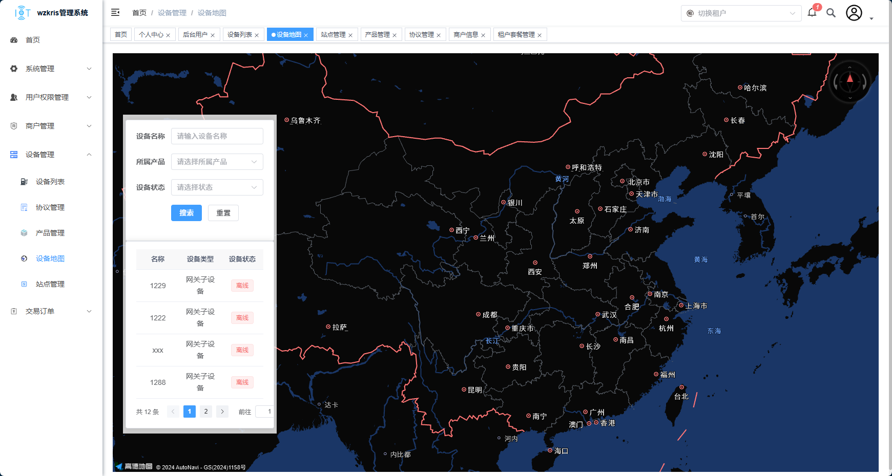

<h1 align="center" style="margin: 30px 0 30px; font-weight: bold;">wzkris-cloud</h1>
<h4 align="center">基于JDK17的SpringCloudAlibaba + Spring-Authorization-Server的微服务框架</h4>

~~~
com.wzkris     
├── wzkris-gateway         // 网关模块 
├── wzkris-auth            // OAuth2认证服务
├── wzkris-common          // 模块控制
│       └── wzkris-common-bom                          // 模块版本控制
│       └── wzkris-common-core                         // 核心模块(工具包)
│       └── wzkris-common-datasource                   // 多数据源
│       └── wzkris-common-excel                        // excel处理
│       └── wzkris-common-loadbanlancer                // rpc均衡负载
│       └── wzkris-common-log                          // 日志记录
│       └── wzkris-common-dubbo                        // rpc
│       └── wzkris-common-orm                          // 持久层框架
│       └── wzkris-common-redis                        // 缓存服务
│       └── wzkris-common-seata                        // 分布式事务
│       └── wzkris-common-security                     // 微服务安全
│       └── wzkris-common-sentinel                     // 限流模块
│       └── wzkris-common-statemachine                 // spring状态机
│       └── wzkris-common-stream                       // spring-stream
│       └── wzkris-common-swagger                      // openAPI3规范
│       └── wzkris-common-web                          // web服务依赖
├── wzkris-modules         // 业务模块
│       └── wzkris-modules-equipment                           // 设备服务 
│       └── wzkris-modules-file                                // 文件服务 
│       └── wzkris-modules-system                              // 系统服务 
│       └── wzkris-modules-user                                // 用户服务 
├── wzkris-extends        // 扩展模块
│       └── wzkris-monitor-admin                               // 监控中心 
│       └── wzkris-xxl-job-admin                               // xxl-job控制台 
├──pom.xml                // 依赖管理
~~~

## 内置功能

1. 顾客管理：APP端用户信息管理。
2. 系统用户：租户下的登录账户信息（管理员属于特殊租户）。
2. 租户管理：租户信息，租户套餐，租户钱包。
2. 客户端管理：OAuth2客户端。
3. 部门管理：配置部门，树结构展现支持数据权限。
4. 岗位管理：配置系统用户所属担任职务。
5. 菜单管理：配置系统菜单，操作权限，按钮权限标识等。
6. 角色管理：角色菜单权限分配、设置角色按部门进行数据范围权限划分。
7. 字典管理：对系统中经常使用的一些较为固定的数据进行维护。
8. 参数管理：对系统动态配置常用参数。
9. 系统消息：系统通知公告信息发布维护。
10. 操作日志：系统正常操作日志记录和查询；系统异常信息日志记录和查询。
11. 登录日志：系统登录日志记录查询（只记录登录成功的）。
13. 定时任务：xxl-job。
14. 系统接口：根据业务代码自动生成相关的api接口文档。

## 技术架构

- JDK版本：17
- 后端框架：SpringCloud + SringCloudAlibaba + SpringBoot
- 安全框架：Spring-Authorization-Server
- 持久层框架：Mybatis-Plus
- RPC框架：Dubbo3
- 定时任务：xxl-job
- 中间件：Nacos + Mysql + Redis（至少需要这三个组件项目才可以运行，MQ根据需要自行搭配Spring-stream）

## 演示图

